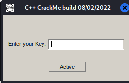
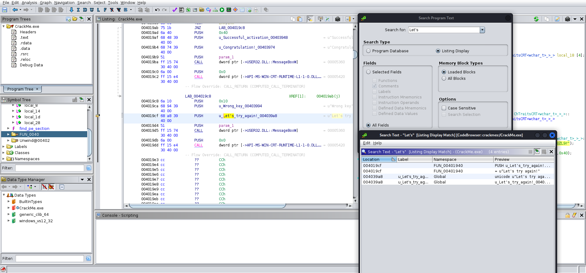
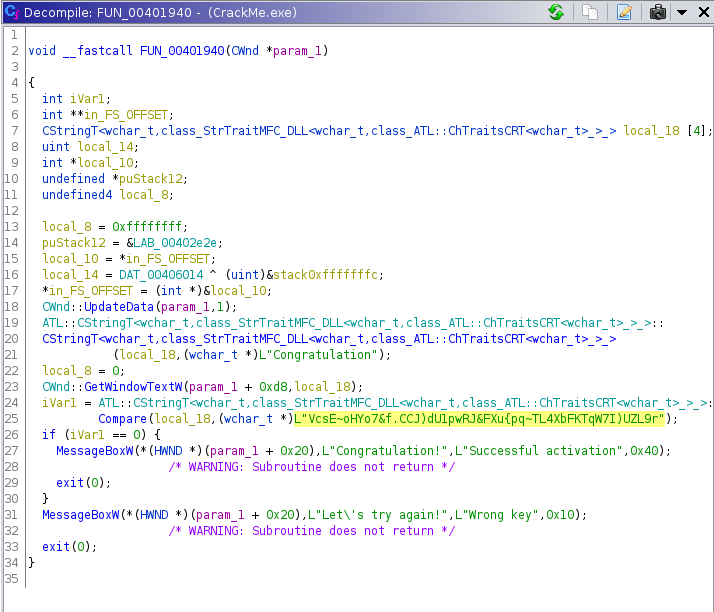
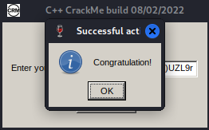

# Crackme_with_GUI

### Prompt

```
Author:
hoangnguyen

Language:
C/C++

Upload:
11:08 AM 08/03/2022

Platform
Windows

Difficulty:
2.0 Rate!

Quality:
3.5 Rate!

Arch:
x86

Description

Good luck for you!
```

### Attachments

CrackMe.exe

### Solution

The file given is an EXE file with a GUI with an input field.
Entering the wrong key results in a pop up message that says "Let's try again!"



Running the command "strings" and "pstree" on the file did not reveal anything interesting.

I disassembled the file using Ghidra and search for the string "Let's" (This is a portion of the message that popped up when a wrong key is entered).



We found 4 instances of the string "Let's" within the executable, and one of them is inside the function that determines if the key is correct or not (FUN_00401940).



Reading through the decompiled code, I found a garbled string being compared with a variable that will later be used to determine if the key is correct or not.

```
VcsE~oHYo7&f.CCJ)dU1pwRJ&FXu{pq~TL4XbFKTqW7I)UZL9r
```

Inputting this string in the EXE file, we get the message "Congratulations!".


